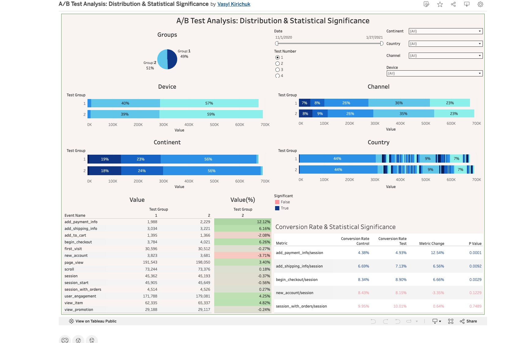

# A/B Test Analysis

This project analyzes an A/B test using Python and statistical methods to evaluate experiment results.

## Tools

- Python
- Pandas
- NumPy
- SciPy
- Matplotlib

## What was analyzed

- Data quality
- Data distribution
- Normality tests
- Statistical significance
- Hypothesis testing

## Files

- `Portfolio2.ipynb` – Python analysis
- `README.md` – Project description

## Dashboard Preview

🔗 [Tableau Dashboard](https://public.tableau.com/views/Portfolio2_17852343207190/ABTestAnalysisDistributionStatisticalSignificance)
